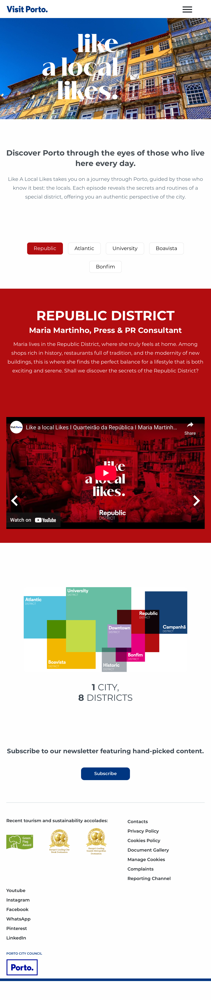
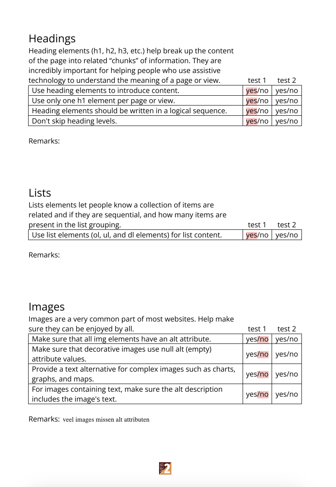
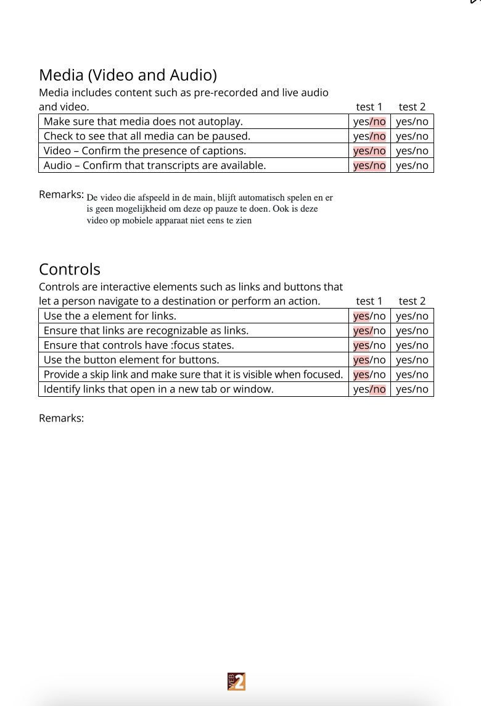
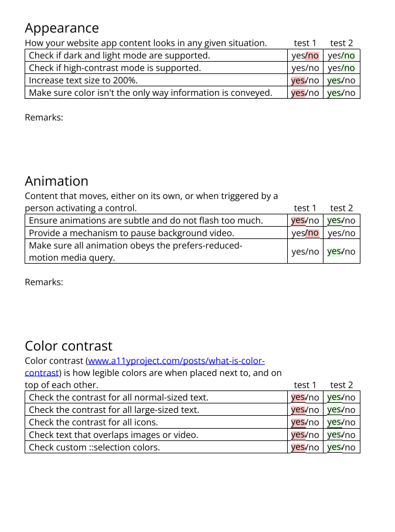
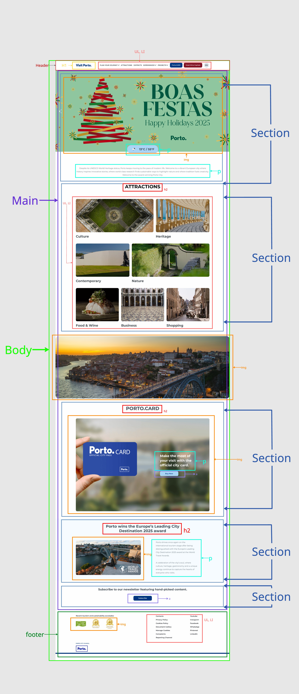
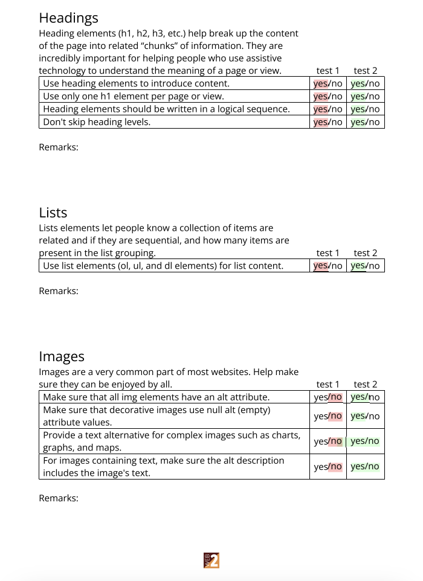
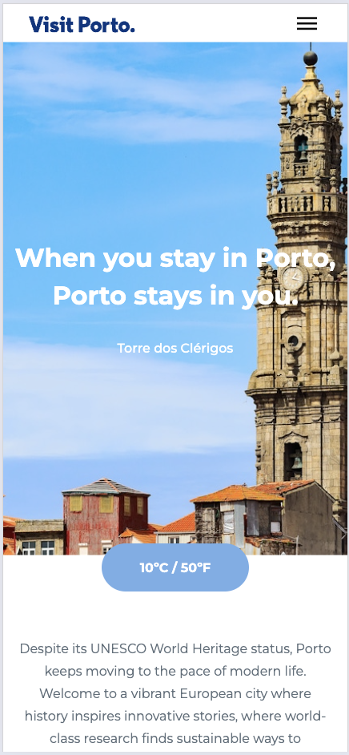
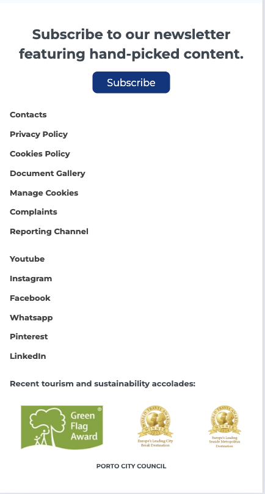
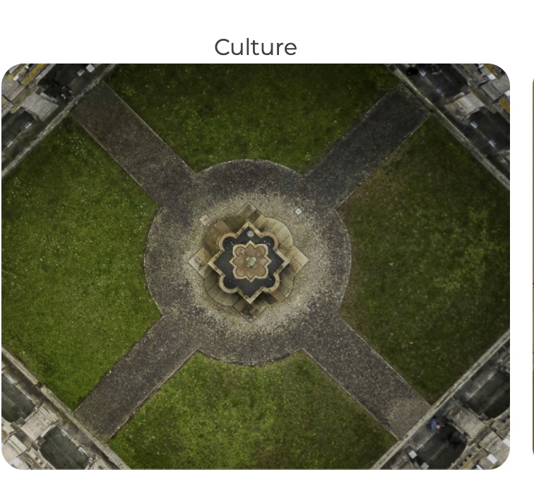

# Procesverslag
Markdown is een simpele manier om HTML te schrijven.  
Markdown cheat cheet: [Hulp bij het schrijven van Markdown](https://github.com/adam-p/markdown-here/wiki/Markdown-Cheatsheet).

Nb. De standaardstructuur en de spartaanse opmaak van de README.md zijn helemaal prima. Het gaat om de inhoud van je procesverslag. Besteedt de tijd voor pracht en praal aan je website.

Nb. Door *open* toe te voegen aan een *details* element kun je deze standaard open zetten. Fijn om dat steeds voor de relevante stuk(ken) te doen.

## Jij

  
uitwerken voor kick-off werkgroep

  ### Auteur:
  Zoë Wammes

  Blauw

  #### Je focus:
  Surface plane
 

## Je website

  
uitwerken voor kick-off werkgroep

  ### Je opdracht:
  https://visitporto.travel/en-GB#

  #### Screenshot(s) van de eerste pagina (small screen): 
  hier de naam van de pagina  
  

  #### Screenshot(s) van de tweede pagina (small screen):
  hier de naam van de pagina  
  
 

## Toegankelijkheidstest 1/2 (week 1)

  
uitwerken na test in 2e werkgroep

  
  
  
  
  
  

  ### Bevindingen
  Lijst met je bevindingen die in de test naar voren kwamen:

  Skip link aanwezig
  Lang attribuut correct (en-GB)
  Responsive design
  Keyboard navigatie werkt
  Alt-attributen ontbreken bij afbeeldingen

## Breakdownschets (week 1)

  
uitwerken na afloop 3e werkgroep

  ### de hele pagina: 
  

  ### dynamisch deel (bijv menu): 
  

## Voortgang 1 (week 2)

  
uitwerken voor 1e voortgang

  ### Stand van zaken
  Bij de eerste voortgang gesprek, ging de html best goed, ik was nog niet begonnen aan de css, maar dat hoefte ook niet. Ik had niet zoveel vragen. Meer of mijn opbouw een beetje goed was en of ik articles en sections goed heb gebruikt.Zo bleek uiteindelijk dat het beter was om Li's in mijn geval te gebruiken ipv articles. en dit had ik dan ook aangepast

  ### Agenda voor meeting
  samen met je groepje opstellen

  | Zoë      | Nathan          |Tess    | Artemis        |
  | ---            | ---                | ---          | ---              |
  |Voortgang, niks specifieks       | voortgang | Voortgang    | Voortgang       |
  |  | Html | Html | |
  | ...            | ...                | ...          | ...              |

  ### Verslag van meeting
  hier na afloop snel de uitkomsten van de meeting vastleggen

  - De site die ik had gekozen was prima.
  - Van articals ul's en li's maken, gezien het onderdeel uit maakt van een groter onderdeel "attractions"
 - Ik had verder nog niet zo veel, dus er zijn ook niet veel uitkomsten uit gekomen 

## Voortgang 2 (week 3)

  
uitwerken voor 2e voortgang

  ### Stand van zaken
  Ik had hier vooral vragen over de CSS en of ik goed op weg was. Ik had met de CSS vooral moeite omdat ik niet zo goed wist of ik nou echt goed op weg was. Dit was wel zo en ik ben hier uit verder gegaan. Er zijn een paar elementen een beetje op geschoont, maar naar mijn idee was er niet veel op aangemerkt. 

  ### Agenda voor meeting
  samen met je groepje opstellen

  | Zoë      | Nathan         | Tess   | Artemis        |
  | ---            | ---                | ---          | ---              |
  | Voortgang  | Voortgang            | Voortang   |     |
  |CSS | CSS |  |  |
  | ...            | ...                | ...          | ...              |

  ### Verslag van meeting
  De css zag er goed uit en was niet veel op aan te merken 

## Toegankelijkheidstest 2/2 (week 4)

  
uitwerken na test in 9e werkgroep

  ### Bevindingen
  Lijst met je bevindingen die in de test naar voren kwamen (geef ook aan wat er verbeterd is)
  
  Tekst op fotos, zijn ook echt teksten op de fotos en geen plaatjes
  De HTML is semantisch correct
  Er zijn alt teksten toegevoegd en alle images zijn voorzien
  van een beschrijving

  er is geen skiplink aanwezig
  de html is foutloos

## Voortgang 3 (week 4)

  
uitwerken voor 3e voortgang

  ### Stand van zaken
  De html en css voor de eerste pagina waren hier zo goed als af. Ik moest nog beginnen aan mijn tweede pagina omdat ik bang was dat het te generiek was aan elkaar. Maar met behulp van davis is het goed gelukt, en is het mij makkelijker gemaakt. 
  David heeft mij geholpen om een soort carrousel te maken en de li's te linken aan de de li's waar de informatie in staat. 
  Ook heeft david mij uitgelegd hoe ik makkelijk tekst op de afbeeldingen kan zetten. 

  David heeft mij een hele breakdown gegeven van bijde onderdelen en hoe je het moet doen, en ik heb het verder gestileerd in de css 
  

  ### Agenda voor meeting
  samen met je groepje opstellen

  niemand van mijn groepje was hier bij dus ik heb geen idee of zij nog wat hebben gevraagd... 

  ### Verslag van meeting
  er is gekeken naar hoe ik mijn html het beste kon opstellen voor de 2e pagina. En duidelijk uitgelegd wat ik het beste kan doen. Verder is er niet veel besproken, en ben ik vooral gewoon geholpen, zodat ik meteen kon beginnen aan mijn tweede pagina. 

## Eindgesprek (week 5)

  
uitwerken voor eindgesprek

  ### Je uitkomst - karakteristiek screenshots:
  
  
  
  
  
  
  

  ### Dit ging goed/Heb ik geleerd: 
  Ik heb eigelijk best veel geleerd. Vooral het gebruik van nth-of-type etc, heb ik voor mijn gevoel goed onder de knie gekregen. Ook heb ik geleerd hoe je met display: flex; en overflow: auto; iets scrollbaar kan maken. En door gebruik te maken van flex: shrink; je er voor kan zorgen dat de afbeeldingen een vast formaat behouden. Ook vond ik het echt leuk om dingen te animeren in de css en zou er wel nog beter in kunnen worden. Gelukkig hadden we voorbeelden in codepen die we konden na maken, dus die hebben ook echt goed geholpen

  
  

  ### Dit was lastig/Is niet gelukt:
  Hamburger menu, gelukkig is dit wel gelukt. Maar ik vond het best lastig te begrijpen en toe te passen. Ik heb gelukkig wel goed hulp gekregen er mee. Ook was het de bedoeling om bij de 2e sections in mijn main de tekst op de plaatsjes te krijgen maar dat is niet gelukt helaas.
  En wegens de tijd heb ik het ook gelaten, en ben ik verder gegaan met de dingen die wel lukken. 

  

## Bronnenlijst

  
continu bijhouden terwijl je werkt

  Nb. Wees specifiek ('css-tricks' als bron is bijv. niet specifiek genoeg). 
  Nb. ChatGpT en andere AI horen er ook bij.
  Nb. Vermeld de bronnen ook in je code.

  1. Alle afbeeldingen en content komen van de visit porto pagina zelf. https://visitporto.travel/en-GB
  2. Ik heb de eerste foto van de hoofdpagina van https://www.musement.com/nl/porto/torre-dos-clerigos-v/
  3. oefeningen code-pen
  4. Hamburger menu: david https://codepen.io/Dave-deo/pen/EaKpLWj
  5. scroll tabs: david https://codepen.io/Dave-deo/pen/XJdybrr

  5. hulp css en html: david en maya

